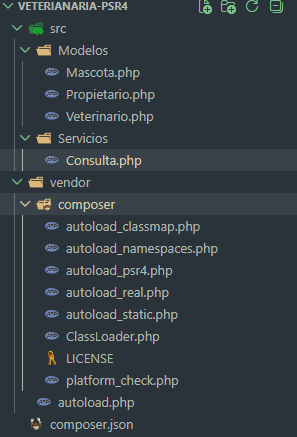
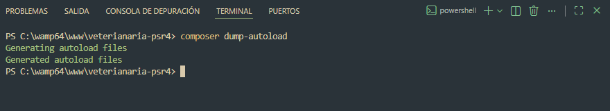
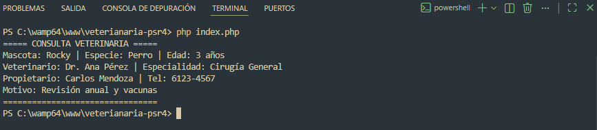

# 🐾 Sistema de Gestión de Clínica Veterinaria — PSR-4 Autoload con Composer

> **Curso:** Desarrollo de Software VII  
> **Laboratorio:** Implementación de la Carga Automática (Autoload) bajo el Estándar PSR-4 con Composer  
> **Semestre:** I Semestre 2026

---

## 📋 Descripción

Este proyecto implementa un sistema de gestión para una clínica veterinaria utilizando **PHP orientado a objetos**, organizado bajo el estándar **PSR-4** y gestionado con **Composer Autoload**. El objetivo principal es demostrar cómo eliminar el uso de `require` e `include` manuales mediante la carga automática de clases.

---

## 📁 Estructura de Archivos

```
veterinaria-psr4/
│
├── src/
│   ├── Modelos/
│   │   ├── Mascota.php         → namespace Veterinaria\Modelos
│   │   ├── Propietario.php     → namespace Veterinaria\Modelos
│   │   └── Veterinario.php     → namespace Veterinaria\Modelos
│   │
│   └── Servicios/
│       └── Consulta.php        → namespace Veterinaria\Servicios
│
├── vendor/                     ← generado automáticamente por Composer
│   ├── autoload.php            ← archivo mágico del autoloader
│   └── composer/
│       └── autoload_psr4.php   ← mapa de namespaces generado
│
├── composer.json               ← configuración del proyecto y mapeo PSR-4
├── .gitignore                  ← excluye la carpeta vendor/
└── index.php                   ← punto de entrada, prueba el autoload
```


### 🗺️ Relación Namespace → Carpeta Física (PSR-4)

| Namespace | Carpeta Física | Ejemplo de Clase |
|---|---|---|
| `Veterinaria\Modelos` | `src/Modelos/` | `Mascota`, `Veterinario`, `Propietario` |
| `Veterinaria\Servicios` | `src/Servicios/` | `Consulta` |

> **Regla PSR-4:** El prefijo `Veterinaria\\` está mapeado a `src/` en el `composer.json`. Composer reemplaza el prefijo del namespace por la ruta física para encontrar cada archivo automáticamente.

---

## ⚙️ Guía de Instalación

### Requisitos previos
- PHP >= 8.0
- Composer instalado globalmente

### Pasos

**1. Clonar el repositorio:**
```bash
git clone https://github.com/tu-usuario/veterinaria-psr4.git
cd veterinaria-psr4
```

**2. Generar el autoloader de Composer:**
```bash
composer dump-autoload
```
> Esto crea la carpeta `vendor/` con el archivo `autoload.php` y el mapa de namespaces PSR-4. La carpeta `vendor/` está excluida del repositorio mediante `.gitignore`, por lo que **siempre debe generarse localmente**.

**3. Ejecutar el proyecto:**
```bash
php index.php
```

---

## 🔑 Configuración del `composer.json`

```json
{
    "name": "veterinaria/sistema",
    "description": "Sistema de gestión de clínica veterinaria con PSR-4 Autoload",
    "type": "project",
    "require": {
        "php": ">=8.0"
    },
    "autoload": {
        "psr-4": {
            "Veterinaria\\": "src/"
        }
    }
}
```

El bloque `autoload > psr-4` es el núcleo del laboratorio. Le indica a Composer que cualquier clase cuyo namespace comience con `Veterinaria\` se encuentra físicamente dentro de la carpeta `src/`.

---

## 🧪 Prueba de Funcionamiento

Al ejecutar `php index.php`, el sistema instancia objetos de las cuatro clases **sin ningún `require` manual**. La única línea de carga necesaria es:

```php
require_once __DIR__ . '/vendor/autoload.php';
```

A partir de ahí, las clases se importan con `use`:

```php
use Veterinaria\Modelos\Mascota;
use Veterinaria\Modelos\Veterinario;
use Veterinaria\Modelos\Propietario;
use Veterinaria\Servicios\Consulta;
```

### Resultado esperado en terminal:

```
===== CONSULTA VETERINARIA =====
Mascota: Rocky | Especie: Perro | Edad: 3 años
Veterinario: Dr. Ana Pérez | Especialidad: Cirugía General
Propietario: Carlos Mendoza | Tel: 6123-4567
Motivo: Revisión anual y vacunas
================================
```



---

## 🗑️ Higiene del Repositorio — `.gitignore`

```gitignore
/vendor/
```

La carpeta `vendor/` **nunca se sube al repositorio**. Contiene el autoloader generado por Composer y puede pesar varios megabytes. Cualquier colaborador que clone el proyecto debe ejecutar `composer dump-autoload` para regenerarla localmente.

---

## 📊 Conclusiones Técnicas

### 1. ✅ Mantenibilidad
Con PSR-4 y Composer, agregar una nueva clase al proyecto es tan sencillo como crear el archivo en la carpeta correcta con el namespace correspondiente. **No es necesario modificar ningún archivo de configuración global** ni agregar `require` en otros archivos. El autoloader descubre la clase automáticamente en el siguiente `dump-autoload`.

### 2. ⚡ Eficiencia de Memoria — Lazy Loading
El autoloader de Composer implementa **carga bajo demanda (Lazy Loading)**: una clase solo se carga en memoria en el momento exacto en que se instancia por primera vez. Esto significa que si una clase nunca es usada en una ejecución, PHP nunca la carga. En proyectos grandes con decenas de clases, este comportamiento reduce significativamente el consumo de memoria del servidor en comparación con cargar todos los archivos al inicio con `require`.

### 3. 🤝 Estandarización y Trabajo Colaborativo
Seguir el estándar PSR-4 garantiza que cualquier desarrollador familiarizado con el ecosistema PHP (Laravel, Symfony, etc.) pueda entender la estructura del proyecto de inmediato. La correspondencia directa entre namespace y carpeta física elimina la ambigüedad sobre dónde vive cada clase, facilitando el trabajo en equipo y la integración con herramientas externas como IDEs y analizadores estáticos.

---

## 🛠️ Tecnologías Utilizadas

- **PHP 8.0+**
- **Composer** — gestor de dependencias
- **Estándar PSR-4** — autoloading
- **Estándar PSR-1** — convenciones de código (StudlyCaps, una clase por archivo)